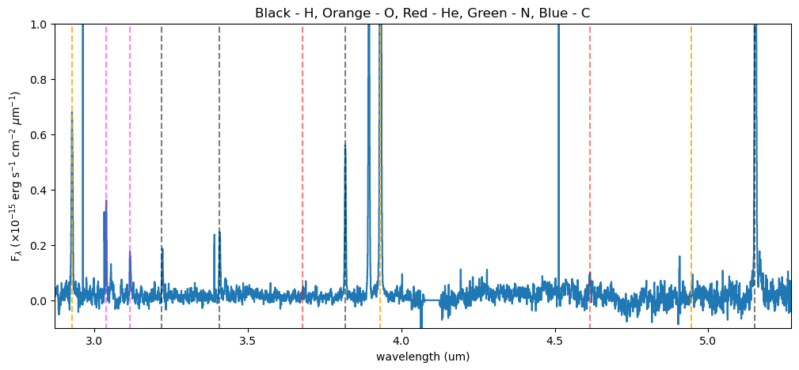
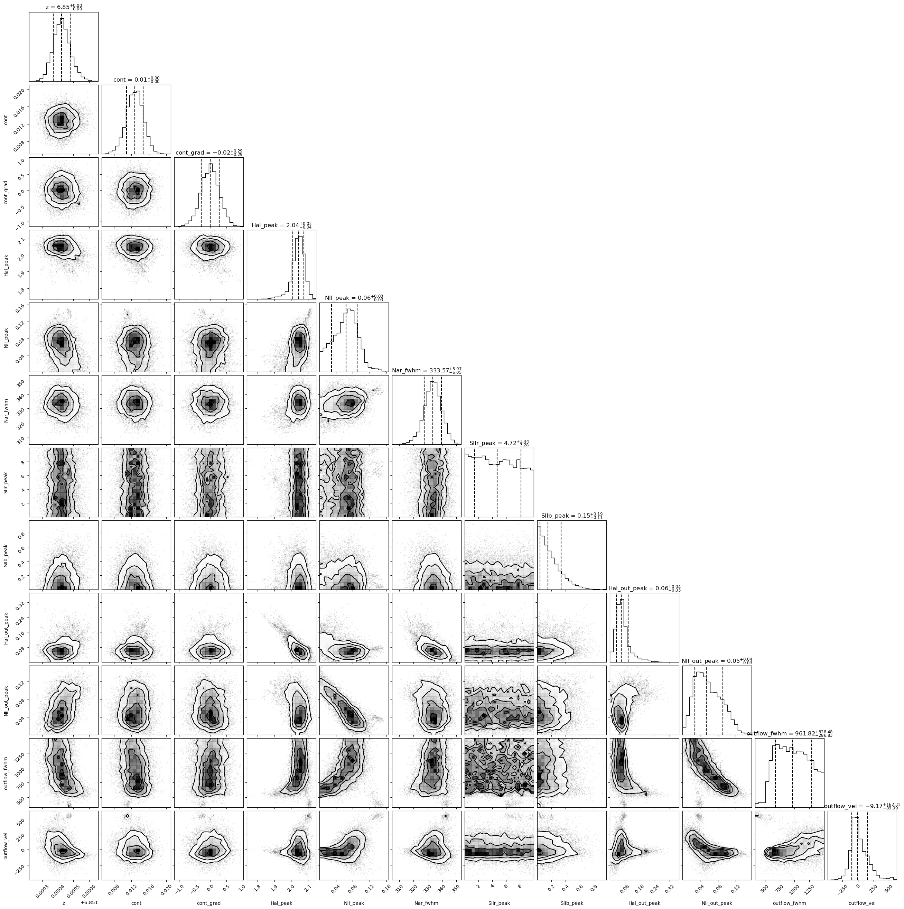
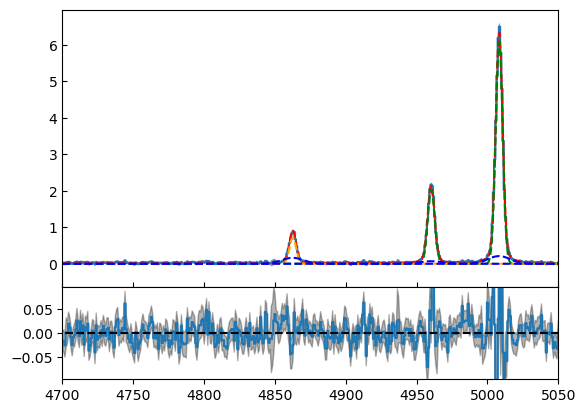
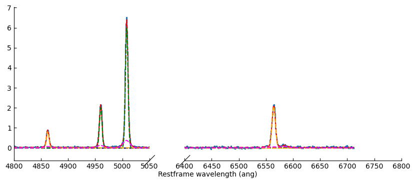
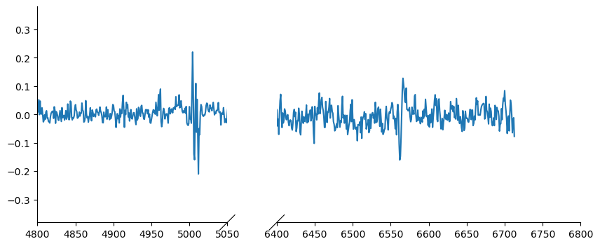
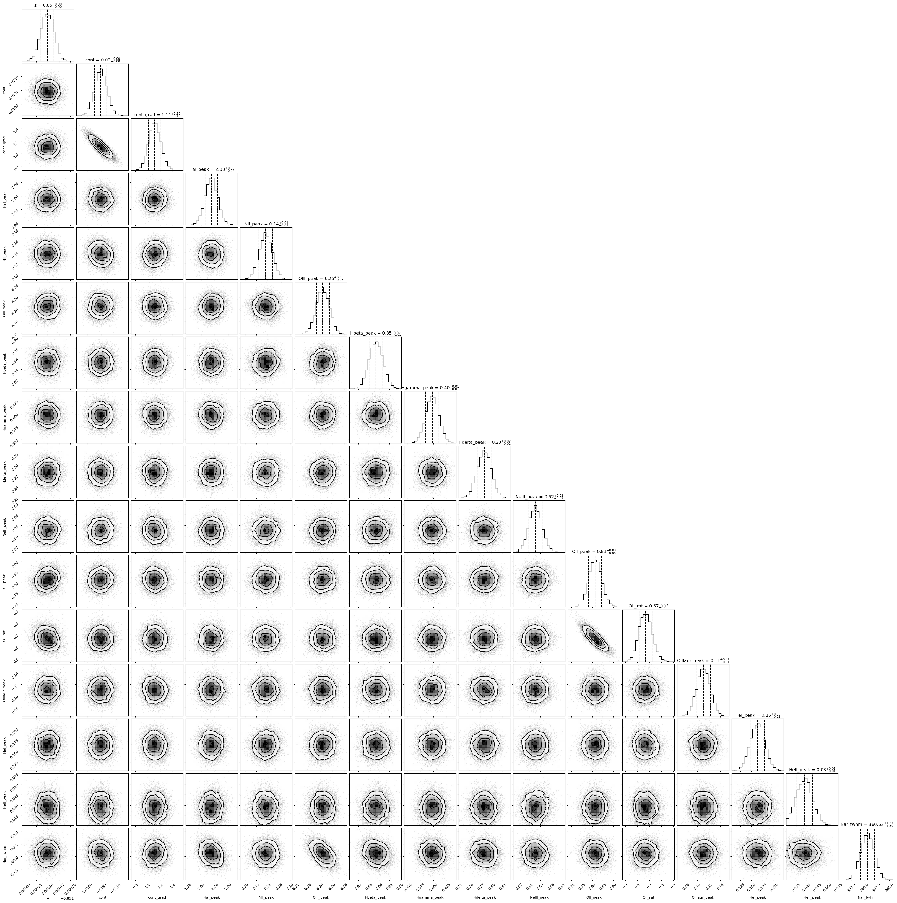
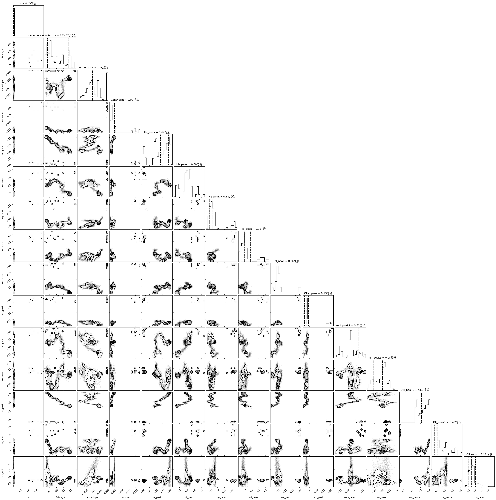

.. _Fitting:

Fitting a single spectrum
===================================
In this section we will fit the extracted spectrum from the previous section. First we will quickly import some modules. 

.. code:: ipython3

    #importing modules
    import numpy as np
    import matplotlib.pyplot as plt; plt.ioff()

    c= 3e8
    
    import QubeSpec as IFU
    import QubeSpec.Plotting as emplot
    import QubeSpec.Fitting as emfit
    import yaml
    

now lets load the Cube object from previous page.

.. code:: ipython3

    Cube = IFU.Cube()
    Cube.load('/Users/jansen/Test.txt')

Plotting spectrum
-----------------

Lets just have a look at all the emission lines in the spectrum.

.. code:: ipython3

    f, ax = plt.subplots(1, figsize=(12,5))
    
    ax.plot(Cube.obs_wave, Cube.D1_spectrum, drawstyle='steps-mid')
    
    ylow = -0.2
    yhig = 10
    
    ax.vlines(0.5008*(1+Cube.z),ylow,yhig, linestyle='dashed',color='orange', alpha=0.8)
    ax.vlines(0.3727*(1+Cube.z),ylow,yhig, linestyle='dashed',color='orange', alpha=0.8)
    ax.vlines(0.6300*(1+Cube.z),ylow,yhig, linestyle='dashed',color='orange', alpha=0.8)
    
    
    ax.vlines(0.6563*(1+Cube.z),ylow,yhig, linestyle='dashed',color='k', alpha=0.5)
    ax.vlines(0.4861*(1+Cube.z),ylow,yhig, linestyle='dashed',color='k', alpha=0.5)
    ax.vlines(0.4340*(1+Cube.z),ylow,yhig, linestyle='dashed',color='k', alpha=0.5)
    ax.vlines(0.4100*(1+Cube.z),ylow,yhig, linestyle='dashed',color='k', alpha=0.5)
    ax.vlines(0.1215*(1+Cube.z),ylow,yhig, linestyle='dashed',color='k', alpha=0.5)
    ax.vlines(0.6731*(1+Cube.z),ylow,yhig, linestyle='dashed',color='k', alpha=0.5)
    
    ax.vlines(0.3869*(1+Cube.z),ylow,yhig, linestyle='dashed',color='magenta', alpha=0.5)
    ax.vlines(0.3968*(1+Cube.z),ylow,yhig, linestyle='dashed',color='magenta', alpha=0.5)
    ax.vlines(0.2424*(1+Cube.z),ylow,yhig, linestyle='dashed',color='magenta', alpha=0.5)
    
    
    ax.vlines(0.4686*(1+Cube.z),ylow,yhig, linestyle='dashed',color='red', alpha=0.5)
    ax.vlines(0.5877*(1+Cube.z),ylow,yhig, linestyle='dashed',color='red', alpha=0.5)
    
    ax.set_title('Black - H, Orange - O, Red - He, Green - N, Blue - C')
    
    ax.set_xlabel('wavelength (um)')
    ax.set_ylabel(r'F$_\lambda$ ($\times 10^{-15}$ erg s$^{-1}$ cm$^{-2}$ $\mu$m$^{-1}$)')
    
    ax.set_xlim(min(Cube.obs_wave), max(Cube.obs_wave))
    ax.set_ylim(-0.1, 1)
    plt.show()

Simple fit
----------

Ok so there will be/is a full tutorial/jupyer notebook, but I will
briefly explain it here. Under the hood, QubeSpec is using emcee to fit
the lines. As such you need to give it some model, initial conditions
and priors. However, I written some methods in the QubeSpec and
emfit.Fitting classes that do all of the work. However you can still
change the priors by supplying new updated priors in a dictionary form.
The shape of the dictionary should be as such:

priors = {} priors[ ‘name of the variable’] = [ initial_value or 0,
‘shape of the prior’, paramters of the prior]

‘name of the variable’ - I will give a full list of variable for each
models below.

intial value - inital value for the fit - if you want the code to decide
put 0

‘shape of the prior’ - ‘uniform’, ‘loguniform’ (uniform in logspace),
‘normal’, ‘normal_hat’ (truncated normal distribution)

Example below:

.. code:: ipython3

    dvmax = 1000/3e5*(1+Cube.z)
    dvstd = 200/3e5*(1+Cube.z)
    priors = {}
    priors['z'] = [Cube.z,'normal_hat', Cube.z, dvstd, Cube.z-dvmax, Cube.z+dvmax]
    priors['cont']=[0.1,'loguniform', -3,1]
    priors['cont_grad']=[0.2,'normal', 0,0.2]
    priors['Hal_peak']=[5.,'loguniform', -3,1]
    priors['NII_peak']=[0.4,'loguniform', -3,1]
    priors['Nar_fwhm']=[300,'uniform', 200,900]
    priors['OIII_peak']=[6.,'loguniform', -3,1]
    priors['OI_peak']=[1.,'loguniform', -3,1]
    priors['HeI_peak']=[1.,'loguniform', -3,1]
    priors['HeII_peak']=[1.,'loguniform', -3,1]
    priors['Hbeta_peak']=[2,'loguniform', -3,1]
    priors['Hgamma_peak'] = [1.,'loguniform',-3,1]
    priors['Hdelta_peak'] = [0.5,'loguniform',-3,1]
    priors['NeIII_peak'] = [0.3,'loguniform',-3,1]
    priors['OII_peak'] = [0.4,'loguniform',-3,1]
    priors['OII_rat']=[1,'normal_hat',1,0.2, 0.2,4]
    priors['OIIIaur_peak']=[0.2,'loguniform', -3,1]
    
    # For variables:
    labels= ['z', 'cont','cont_grad',  'Hal_peak', 'NII_peak', 'OIII_peak', 'Hbeta_peak','Hgamma_peak', 'Hdelta_peak','NeIII_peak','OII_peak','OII_rat','OIIIaur_peak', 'HeI_peak','HeII_peak', 'Nar_fwhm']

In the few section I will describe fitting using these predefined models
and how you can change some inputs.

For each function you can also chnage:

N - number of iterations in a chain (default= 6000) progress - default
True (to see the progress bar)

Fitting Halpha only
~~~~~~~~~~~~~~~~~~~

With this function you can fit the collapse 1D spectrum that you
exctracted earlier. The main key word is models

models - Single_only, Outflow_only, BLR_only, BLR, Outflow, QSO_BKPL

which changes if you fit a single model:

‘Single_only’ - single gaussian to Halpha, both [NII] and both [SII] -
name of the free parameters: [‘z’, ‘cont’,‘cont_grad’, ‘Hal_peak’,
‘NII_peak’, ‘Nar_fwhm’, ‘SIIr_peak’, ‘SIIb_peak’]

‘Outflow_only’ - single gaussian to Halpha, both [NII] and both [SII]
and additional gaussians to Halpha + [NII] to model an outflow - name of
the free parameters: [‘z’, ‘cont’,‘cont_grad’, ‘Hal_peak’, ‘NII_peak’,
‘Nar_fwhm’, ‘SIIr_peak’, ‘SIIb_peak’, ‘Hal_out_peak’, ‘NII_out_peak’,
‘outflow_fwhm’, ‘outflow_vel’]

‘BLR_only’ - single gaussian to Halpha, both [NII] and both [SII] and
additional gaussians to Halpha to model an BLR - name of the free
parameters [‘z’, ‘cont’,‘cont_grad’, ‘Hal_peak’,‘BLR_Hal_peak’,
‘NII_peak’, ‘Nar_fwhm’, ‘BLR_fwhm’, ‘zBLR’, ‘SIIr_peak’, ‘SIIb_peak’]

‘BLR’ and ‘Outflow’ models fit either ‘Single_only’ and ‘BLR_only’ or
‘Single_only’ and ‘Outflow_only’ and decides which is the best model for
the spectrum.

.. code:: ipython3

    Cube.fitting_collapse_Halpha(models='Outflow', plot=1) # priors=priors
    plt.show()

.. image:: Fitting_files/Fitting_10_3.png

.. image:: Fitting_files/Fitting_10_4.png

Fitting [OIII]
~~~~~~~~~~~~~~

simple = 0 or 1 when 1, we tie the Hbeta and OIII kinematics together.
Please just use simple = 1 - Unless fitting high luminosity AGN and when
you get a decent fit the Hbeta still looks wonky.

models - Single_only, Outflow_only, BLR_only, BLR, Outflow, QSO_BKPL

which changes if you fit a single model:

‘Single_only’ - single gaussian to both [OIII] and [Hbeta] - name of the
free parameters: [‘z’, ‘cont’,‘cont_grad’, ‘OIII_peak’, ‘Nar_fwhm’,
‘Hbeta_peak’] if simple=1

‘Outflow_only’ - single gaussian to both [OIII] and Hbeta and additional
gaussians to [OIII]+Hbeta to model an outflow - name of the free
parameters: [‘z’, ‘cont’,‘cont_grad’, ‘OIII_peak’, ‘OIII_out_peak’,
‘Nar_fwhm’, ‘outflow_fwhm’, ‘outflow_vel’, ‘Hbeta_peak’,
‘Hbeta_out_peak’] if simple=1

‘Outflow’ - fits both above.

BLR models TBD

.. code:: ipython3

    # B14 style
    Cube.fitting_collapse_OIII(models='Outflow',simple=1, plot=1)
    plt.show()

.. image:: Fitting_files/Fitting_12_2.png

.. image:: Fitting_files/Fitting_12_3.png

Fitting Halpha + [OIII]
~~~~~~~~~~~~~~~~~~~~~~~

models - Single_only, Outflow_only, BLR, QSO_BKPL, BLR_simple

.. code:: ipython3

    Cube.fitting_collapse_Halpha_OIII(models='Outflow_only', plot=1)
    
    plt.show()

.. image:: Fitting_files/Fitting_14_1.png

.. code:: ipython3

    Cube.D1_fit_results

.. code:: ipython3

    print(IFU.sp.flux_calc_mcmc( Cube.D1_fit_results,Cube.D1_fit_chain, 'OIIIt', Cube.flux_norm ))

Fitting Custom Function
-----------------------

.. code:: ipython3

    def gauss(x, k, mu,FWHM):
        sig = FWHM/3e5*mu/2.35482
        expo= -((x-mu)**2)/(2*sig*sig)
    
        y= k* e**expo
    
        return y
    from astropy.modeling.powerlaws import PowerLaw1D
    
    def Full_optical(x, z, cont,cont_grad,  Hal_peak, NII_peak, OIIIn_peak, Hbeta_peak, Hgamma_peak, Hdelta_peak, NeIII_peak, OII_peak, OII_rat,OIIIc_peak, HeI_peak,HeII_peak, Nar_fwhm):
        # Halpha side of things
        Hal_wv = 6564.52*(1+z)/1e4
        NII_r = 6585.27*(1+z)/1e4
        NII_b = 6549.86*(1+z)/1e4
        
        OIIIr = 5008.24*(1+z)/1e4
        OIIIb = 4960.3*(1+z)/1e4
        Hbeta = 4862.6*(1+z)/1e4
    
        Hal_nar = gauss(x, Hal_peak, Hal_wv, Nar_fwhm)
        NII_nar_r = gauss(x, NII_peak, NII_r, Nar_fwhm)
        NII_nar_b = gauss(x, NII_peak/3, NII_b, Nar_fwhm)
        
        Hgamma_wv = 4341.647191*(1+z)/1e4
        Hdelta_wv = 4102.859855*(1+z)/1e4
        
        Hgamma_nar = gauss(x, Hgamma_peak, Hgamma_wv, Nar_fwhm)
        Hdelta_nar = gauss(x, Hdelta_peak, Hdelta_wv, Nar_fwhm)
        
        
        # [OIII] side of things
        OIIIr = 5008.24*(1+z)/1e4
        OIIIb = 4960.3*(1+z)/1e4
        Hbeta = 4862.6*(1+z)/1e4
    
        OIII_nar = gauss(x, OIIIn_peak, OIIIr, Nar_fwhm) + gauss(x, OIIIn_peak/3, OIIIb, Nar_fwhm)
        Hbeta_nar = gauss(x, Hbeta_peak, Hbeta, Nar_fwhm)
        
        NeIII = gauss(x, NeIII_peak, 3869.68*(1+z)/1e4, Nar_fwhm ) + gauss(x, 0.322*NeIII_peak, 3968.68*(1+z)/1e4, Nar_fwhm)
        
        OII = gauss(x, OII_peak, 3727.1*(1+z)/1e4, Nar_fwhm )  + gauss(x, OII_rat*OII_peak, 3729.875*(1+z)/1e4, Nar_fwhm) 
        
        OIIIc = gauss(x, OIIIc_peak, 4364.436*(1+z)/1e4, Nar_fwhm )
        HeI = gauss(x, HeI_peak, 3889.73*(1+z)/1e4, Nar_fwhm )
        HeII = gauss(x, HeII_peak, 4686.0*(1+z)/1e4, Nar_fwhm )
    
        contm = PowerLaw1D.evaluate(x, cont,Hal_wv, alpha=cont_grad)
    
        return contm+Hal_nar+NII_nar_r+NII_nar_b + OIII_nar + Hbeta_nar + Hgamma_nar + Hdelta_nar + NeIII+ OII + OIIIc+ HeI+HeII

.. code:: ipython3

    dvmax = 1000/3e5*(1+Cube.z)
    dvstd = 200/3e5*(1+Cube.z)
    priors={'z':[Cube.z,'normal_hat', Cube.z, dvstd, Cube.z-dvmax, Cube.z+dvmax]}
    priors['cont']=[0.1,'loguniform', -3,1]
    priors['cont_grad']=[0.2,'normal', 0,0.2]
    priors['Hal_peak']=[5.,'loguniform', -3,1]
    priors['NII_peak']=[0.4,'loguniform', -3,1]
    priors['Nar_fwhm']=[300,'uniform', 200,900]
    priors['OIII_peak']=[6.,'loguniform', -3,1]
    priors['OI_peak']=[1.,'loguniform', -3,1]
    priors['HeI_peak']=[1.,'loguniform', -3,1]
    priors['HeII_peak']=[1.,'loguniform', -3,1]
    priors['Hbeta_peak']=[2,'loguniform', -3,1]
    priors['Hgamma_peak'] = [1.,'loguniform',-3,1]
    priors['Hdelta_peak'] = [0.5,'loguniform',-3,1]
    priors['NeIII_peak'] = [0.3,'loguniform',-3,1]
    priors['OII_peak'] = [0.4,'loguniform',-3,1]
    priors['OII_rat']=[1,'normal_hat',1,0.2, 0.2,4]
    priors['OIIIaur_peak']=[0.2,'loguniform', -3,1]
    
    labels= ['z', 'cont','cont_grad',  'Hal_peak', 'NII_peak', 'OIII_peak', 'Hbeta_peak','Hgamma_peak', 'Hdelta_peak','NeIII_peak','OII_peak','OII_rat','OIIIaur_peak', 'HeI_peak','HeII_peak', 'Nar_fwhm']
    
    use = np.where( ( (Cube.obs_wave> 2.82) | (Cube.obs_wave<3.46) ) & ( (Cube.obs_wave>3.75) | (Cube.obs_wave<4.1) ) & ( (Cube.obs_wave>5) | (Cube.obs_wave<5.3) ) )[0]
    if __name__ == '__main__':
        optical = emfit.Fitting(Cube.obs_wave, Cube.D1_spectrum, Cube.D1_spectrum_er,Cube.z, priors=priors, N=5000, ncpu=3) # Cube.obs_wave[use], Cube.D1_spectrum[use], Cube.D1_spectrum_er[use]
        optical.fitting_general( Full_optical, labels, emfit.logprior_general_scipy)
        

.. code:: ipython3

    import corner
    
    fig = corner.corner(
                IFU.sp.unwrap_chain(optical.chains), 
                labels = labels,
                quantiles=[0.16, 0.5, 0.84],
                show_titles=True,
                title_kwargs={"fontsize": 12})
    #fig.savefig('./corner_full.pdf')
    plt.show()

.. code:: ipython3

    f = plt.figure( figsize=(20,6))
    from brokenaxes import brokenaxes
    ax = brokenaxes(xlims=((2.820,3.45),(3.65,4.05),(5.0,5.3)),  hspace=.01)
    
    ax.plot(Cube.obs_wave, Cube.D1_spectrum, drawstyle='steps-mid')
    ax.plot(Cube.obs_wave, Cube.D1_spectrum_er, drawstyle='steps-mid')
    
    ax.plot(Cube.obs_wave, Full_optical(Cube.obs_wave, *optical.props['popt']), 'r--')
    
    ax.set_xlabel('wavelength (um)')
    ax.set_ylabel('Flux density')
    
    ax.set_ylim(-0.01, 1.2)
    
    plt.show()

.. image:: Fitting_files/Fitting_21_0.png

.. code:: ipython3

    f,ax= plt.subplots(1, figsize=(8,5))
    
    ax.plot(Cube.obs_wave, Cube.D1_spectrum, drawstyle='steps-mid')
    ax.plot(Cube.obs_wave, Full_optical(Cube.obs_wave, *optical.props['popt']), 'r--')
    
    OII_peak = optical.props['OII_peak'][0]
    OII_rat = optical.props['OII_rat'][0]
    zoii=optical.props['z'][0]
    
    OII3727 = gauss(Cube.obs_wave, OII_peak, 3727.1*(1+zoii)/1e4, optical.props['Nar_fwhm'][0])  
    OII3729 = gauss(Cube.obs_wave, OII_rat*OII_peak, 3729.875*(1+zoii)/1e4,optical.props['Nar_fwhm'][0] ) 
    
    ax.plot(Cube.obs_wave, OII3727, 'g--')
    ax.plot(Cube.obs_wave, OII3729, 'b--')
    
    
    ax.set_xlim(3650.1*(1+zoii)/1e4, 3790.1*(1+zoii)/1e4)
    
    ax.set_xlabel('wavelength (um)')
    ax.set_ylabel(r'F$_\lambda$ ($\times 10^{-15}$ erg s$^{-1}$ cm$^{-2}$ $\mu$m$^{-1}$)')
    
    ax.set_ylim(-0.01, 1.2)
    
    plt.show()

.. image:: Fitting_files/Fitting_22_0.png

Flux Calc
~~~~~~~~~

.. code:: ipython3

    print('[OIII] flux from custom', IFU.sp.flux_calc_mcmc(optical.props,optical.chains, 'general', Cube.flux_norm, wv_cent=5008, peak_name='OIII_peak', fwhm_name='Nar_fwhm' ))
    print('Hbeta flux from custom', IFU.sp.flux_calc_mcmc(optical.props,optical.chains, 'general', Cube.flux_norm, wv_cent=4861, peak_name='Hbeta_peak', fwhm_name='Nar_fwhm' ))
    print('[NII] flux from custom',IFU.sp.flux_calc_mcmc(optical.props,optical.chains, 'general', Cube.flux_norm, wv_cent=6587, peak_name='NII_peak', fwhm_name='Nar_fwhm' ))
    print('Halpha flux from custom',IFU.sp.flux_calc_mcmc(optical.props,optical.chains, 'general', Cube.flux_norm, wv_cent=6563, peak_name='Hal_peak', fwhm_name='Nar_fwhm' ))
    print('[OIII]4363 flux from custom',IFU.sp.flux_calc_mcmc(optical.props,optical.chains, 'general', Cube.flux_norm, wv_cent=4363, peak_name='OIIIaur_peak', fwhm_name='Nar_fwhm' ))
    
    print('[OII]3727 flux from custom',IFU.sp.flux_calc_mcmc(optical.props,optical.chains, 'general', Cube.flux_norm, wv_cent=3727, peak_name='OII_peak', fwhm_name='Nar_fwhm', ratio_name='' ))
    print('[OII]3729 flux from custom',IFU.sp.flux_calc_mcmc(optical.props,optical.chains, 'general', Cube.flux_norm, wv_cent=3729, peak_name='OII_peak', fwhm_name='Nar_fwhm', ratio_name='OII_rat' ))

Fitting a custom model by passing a dictionary of components
------------------------------------------------------------

Very highly experimental, still under development, use at your risk!

.. code:: ipython3

    dvmax = 1000/3e5*(1+Cube.z)
    dvstd = 200/3e5*(1+Cube.z)
    
    model_inputs = {}
    model_inputs["m_z"] = [Cube.z, ['normal_hat', Cube.z, dvstd, Cube.z-dvmax, Cube.z+dvmax]]
    model_inputs["m_fwhm_nr"] = [400, ['uniform' , 100, 900]]
    model_inputs["m_ContSlope"] = [0.001, ['normal', 0, 1]]
    model_inputs["m_ContNorm"] = [0.1, ['loguniform', -3, 1]]
    
    #model_inputs["m_fwhm_br"] = [700, ['uniform', 400, 1200]]
    
    model_inputs["l_nr_Ha_peak"]= [1, ['loguniform', -3, 1]]
    model_inputs["l_nr_Ha_wav"] = [0.656452255]
    
    model_inputs["l_nr_Hb_peak"]= [1, ['loguniform', -3, 1]]
    model_inputs["l_nr_Hb_wav"] = [0.4861]
    
    model_inputs["l_nr_Hg_peak"]= [1, ['loguniform', -3, 1]]
    model_inputs["l_nr_Hg_wav"] = [0.4341647191]
    
    model_inputs["l_nr_Hd_peak"]= [1, ['loguniform', -3, 1]]
    model_inputs["l_nr_Hd_wav"] = [0.410285985]
    
    model_inputs["l_nr_HeI_peak"]= [1, ['loguniform', -3, 1]]
    model_inputs["l_nr_HeI_wav"] = [0.388973]
    
    model_inputs["l_nr_OIIIc_peak"]= [1,['loguniform', -3, 1]]
    model_inputs["l_nr_OIIIc_wav"] = [0.43640436]
    
    model_inputs["d_nr_NeIII_wav1"] = [0.386968]
    model_inputs["d_nr_NeIII_wav2"] = [0.396868]
    model_inputs["d_nr_NeIII_peak1"] = [1.0,['loguniform', -3, 1]]
    model_inputs["d_nr_NeIII_ratio"] = [3.1055]
    
    model_inputs["d_nr_NII_wav1"] = [0.6585273]
    model_inputs["d_nr_NII_wav2"] = [0.654986]
    model_inputs["d_nr_NII_peak1"] = [0.1,['loguniform', -3, 1]]
    model_inputs["d_nr_NII_ratio"] = [3]
    
    model_inputs["d_nr_OIII_wav1"] = [0.5008]
    model_inputs["d_nr_OIII_wav2"] = [0.4960]
    model_inputs["d_nr_OIII_peak1"] = [1,['loguniform', -3,1]]
    model_inputs["d_nr_OIII_ratio"] = [2.99]
    
    model_inputs["d_nr_OII_wav1"] = [0.3727]
    model_inputs["d_nr_OII_wav2"] = [0.3729]
    model_inputs["d_nr_OII_peak1"] = [0.9,['loguniform', -3, 1]]
    model_inputs["d_nr_OII_ratio"] = [1,['uniform',0.2, 4]]
    
    
    if __name__ == '__main__':
        optical_cus = emfit.Fitting(Cube.obs_wave, Cube.D1_spectrum, Cube.D1_spectrum_er,Cube.z, priors=priors, N=5000, ncpu=1) # Cube.obs_wave[use], Cube.D1_spectrum[use], Cube.D1_spectrum_er[use]
        optical_cus.fitting_custom(model_inputs, model_name='test')
    

.. code:: ipython3

    import corner
    
    fig = corner.corner(
                IFU.sp.unwrap_chain(optical_cus.chains), 
                labels = optical_cus.labels,
                quantiles=[0.16, 0.5, 0.84],
                show_titles=True,
                title_kwargs={"fontsize": 12})
    #fig.savefig('~/corner_full.pdf')
    plt.show()

