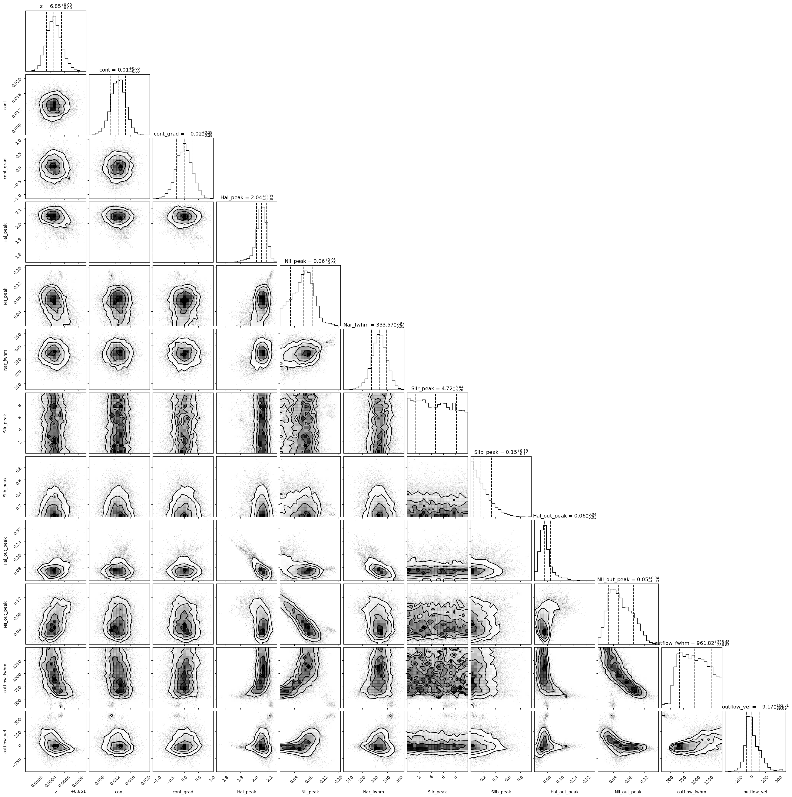
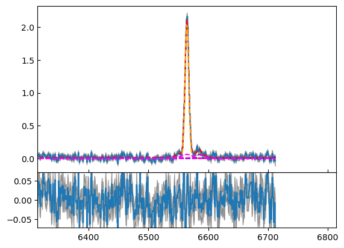
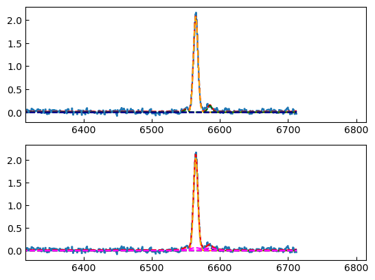
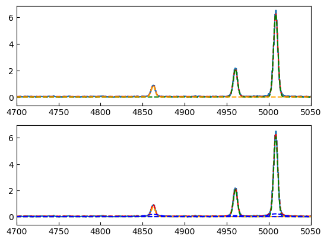
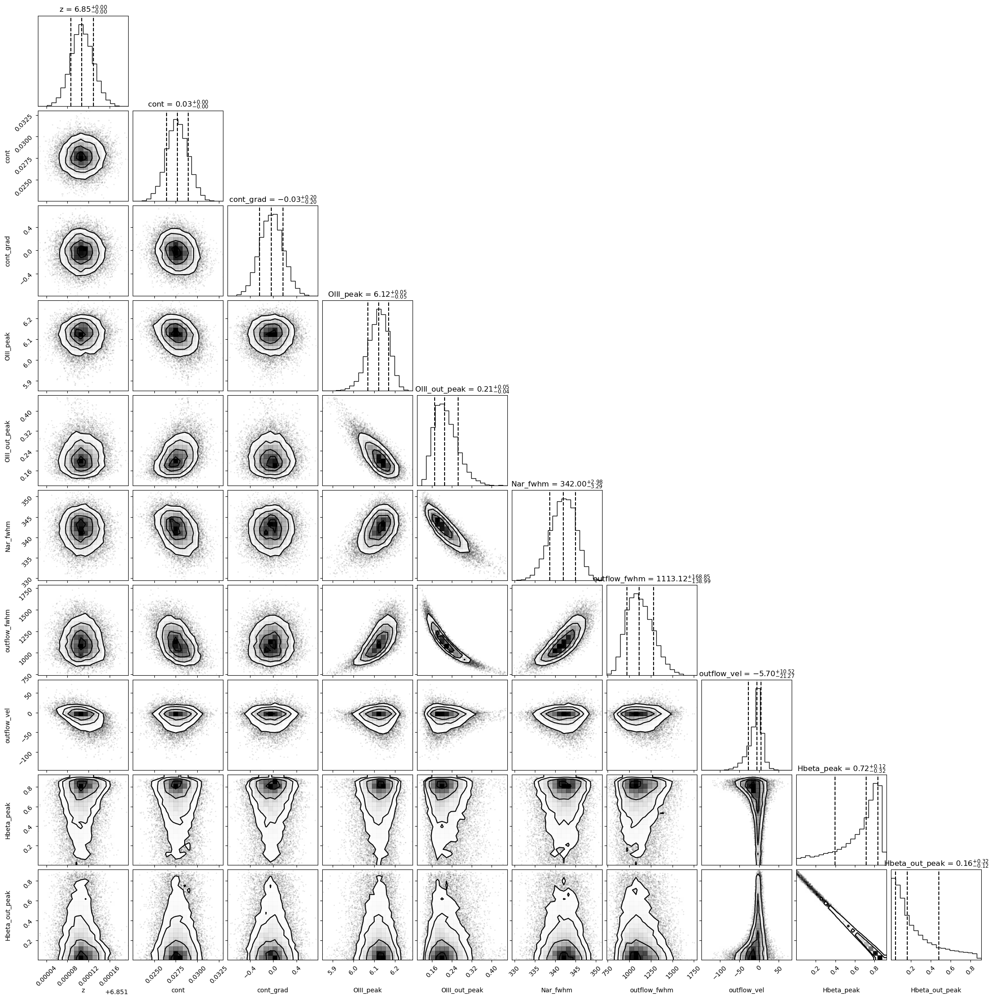
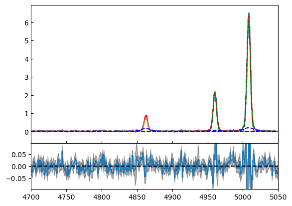
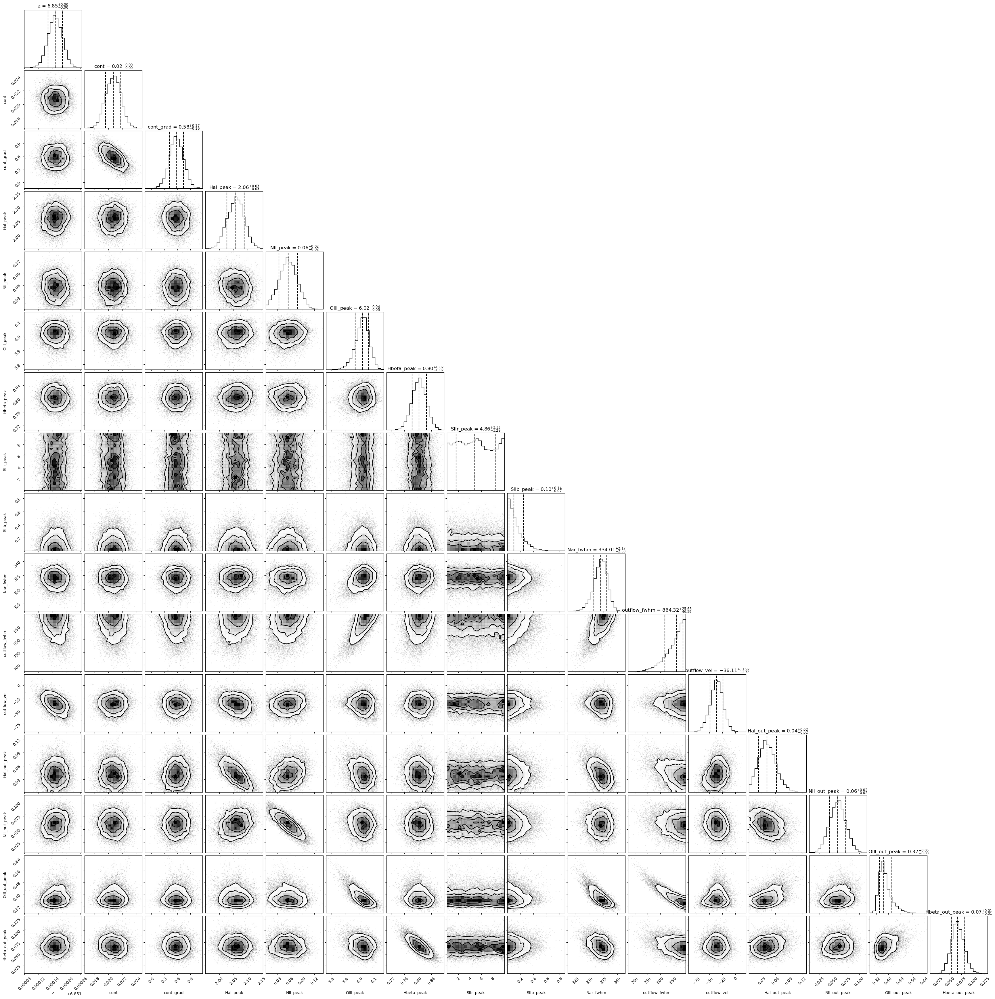
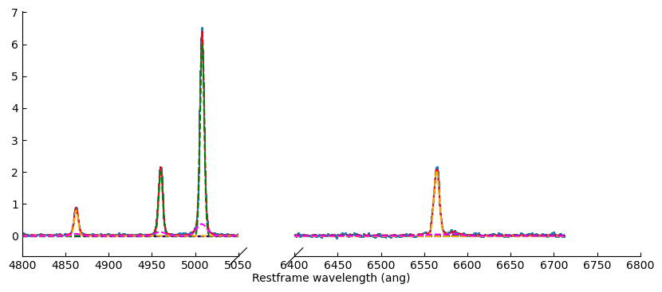
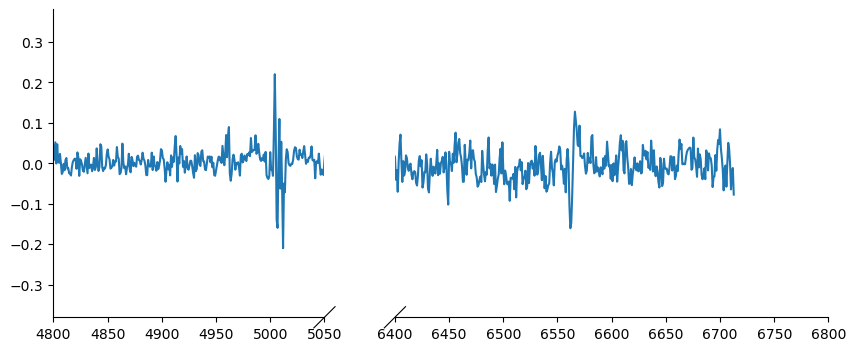

.. _Fitting:

.. contents::
   :local:

Fitting a single spectrum
===================================
In this section we will fit the extracted spectrum from the previous section. First we will quickly import some modules. 

.. code:: ipython3

    #importing modules
    import numpy as np
    import matplotlib.pyplot as plt; plt.ioff()

    c= 3e8
    
    import QubeSpec as IFU
    import QubeSpec.Plotting as emplot
    import QubeSpec.Fitting as emfit
    import yaml
    

Core Fitting module
--------------------

At first we will look into the Fitting class, how it works, what results it generates and how can we calculate other quantities. Then I will introduce the wrapper function I wrote in order to speed up things when fitting.

First lets initalize the Fitting class:

.. autoclass:: QubeSpec.Fitting.Fitting
	:members: fitting_Halpha, fitting_OIII, fitting_Halpha_OIII, fitting_general

The priors variable should be in a form of a dictionary like: 

.. code:: ipython3

    priors = {}

    priors['name of the variable'] = [initial_value_or_0, 'shape of the prior', parameters_of_the_prior]

``'name of the variable'`` - I will give a full list of variable for each models below.

initial value - initial value for the fit - if you want the code to decide put 0

``'shape of the prior'`` - ``'uniform'``, ``'loguniform'`` (uniform in logspace),
``'normal'``, ``'normal_hat'`` (truncated normal distribution)

once this is initialized, we can use some of the prewritten models or use a custom function fitting. Setting up a custom function fitting is a little bit more complex,
but once understood, it is in no way complicated or long. In order fit a custom function you need to use the ``Fitting.fitting_general`` method of the ``Fitting`` class. 

Fitting Custom Function
~~~~~~~~~~~~~~~~~~~~~~~

Once we initialize the ``Fitting`` class we need to define couple of things:

* calllable function with variable: ``wavelength``, ``z`` (redshift) and rest of the free parameters and it will return a 1D array of flux values. 
* name of the parameters in a list - ``labels``
* prior dictionary with initial values - ``priors``

Below I will show an example of such function that fits a spectrum from [OII] to [SII] with one Gaussian component with tied kinematics plus a continuum described as power law. 

.. code:: ipython3

    def gauss(x, k, mu,FWHM):
        sig = FWHM/3e5*mu/2.35482
        expo= -((x-mu)**2)/(2*sig*sig)
    
        y= k* e**expo
    
        return y
    from astropy.modeling.powerlaws import PowerLaw1D
    
    def Full_optical(x, z, cont,cont_grad,  Hal_peak, NII_peak, OIIIn_peak, Hbeta_peak, Hgamma_peak, Hdelta_peak, NeIII_peak, OII_peak, OII_rat,OIIIc_peak, HeI_peak,HeII_peak, Nar_fwhm):
        # Halpha side of things
        Hal_nar = gauss(x, Hal_peak, 6564.52*(1+z)/1e4, Nar_fwhm)
        NII_nar_r = gauss(x, NII_peak, 6585.27*(1+z)/1e4, Nar_fwhm)
        NII_nar_b = gauss(x, NII_peak/3, 6549.86*(1+z)/1e4, Nar_fwhm)
    
        Hgamma_nar = gauss(x, Hgamma_peak, 4341.647191*(1+z)/1e4, Nar_fwhm)
        Hdelta_nar = gauss(x, Hdelta_peak, 4102.859855*(1+z)/1e4, Nar_fwhm)
        
        
        # [OIII] side of things
    
        OIII_nar = gauss(x, OIIIn_peak, 5008.24*(1+z)/1e4, Nar_fwhm) + gauss(x, OIIIn_peak/3, 4960.3*(1+z)/1e4, Nar_fwhm)
        Hbeta_nar = gauss(x, Hbeta_peak, 4862.6*(1+z)/1e4, Nar_fwhm)
        
        NeIII = gauss(x, NeIII_peak, 3869.68*(1+z)/1e4, Nar_fwhm ) + gauss(x, 0.322*NeIII_peak, 3968.68*(1+z)/1e4, Nar_fwhm)
        
        OII = gauss(x, OII_peak, 3727.1*(1+z)/1e4, Nar_fwhm )  + gauss(x, OII_rat*OII_peak, 3729.875*(1+z)/1e4, Nar_fwhm) 
        
        OIIIc = gauss(x, OIIIc_peak, 4364.436*(1+z)/1e4, Nar_fwhm )
        HeI = gauss(x, HeI_peak, 3889.73*(1+z)/1e4, Nar_fwhm )
        HeII = gauss(x, HeII_peak, 4686.0*(1+z)/1e4, Nar_fwhm )
    
        contm = PowerLaw1D.evaluate(x, cont,6564.52*(1+z)/1e4, alpha=cont_grad)
    
        return contm+Hal_nar+NII_nar_r+NII_nar_b + OIII_nar + Hbeta_nar + Hgamma_nar + Hdelta_nar + NeIII+ OII + OIIIc+ HeI+HeII
    
    # list of variable in the right order as in the function above. 
    labels= ['z', 'cont','cont_grad',  'Hal_peak', 'NII_peak', 'OIII_peak', 'Hbeta_peak','Hgamma_peak', 'Hdelta_peak','NeIII_peak','OII_peak','OII_rat','OIIIaur_peak', 'HeI_peak','HeII_peak', 'Nar_fwhm']

    
    z = 6.4
    dvmax = 1000/3e5*(1+z)
    dvstd = 200/3e5*(1+z)

    priors={'z':[z,'normal_hat', z, dvstd, z-dvmax, z+dvmax]}
    priors['cont']=[0.1,'loguniform', -3,1]
    priors['cont_grad']=[0.2,'normal', 0,0.2]
    priors['Hal_peak']=[5.,'loguniform', -3,1]
    priors['NII_peak']=[0.4,'loguniform', -3,1]
    priors['Nar_fwhm']=[300,'uniform', 200,900]
    priors['OIII_peak']=[6.,'loguniform', -3,1]
    priors['OI_peak']=[1.,'loguniform', -3,1]
    priors['HeI_peak']=[1.,'loguniform', -3,1]
    priors['HeII_peak']=[1.,'loguniform', -3,1]
    priors['Hbeta_peak']=[2,'loguniform', -3,1]
    priors['Hgamma_peak'] = [1.,'loguniform',-3,1]
    priors['Hdelta_peak'] = [0.5,'loguniform',-3,1]
    priors['NeIII_peak'] = [0.3,'loguniform',-3,1]
    priors['OII_peak'] = [0.4,'loguniform',-3,1]
    priors['OII_rat']=[1,'normal_hat',1,0.2, 0.2,4]
    priors['OIIIaur_peak']=[0.2,'loguniform', -3,1]
    

Then we can initialize the ``Fitting`` class as variable ``optical`` and then run it in the following manner:

.. code:: ipython3

    if __name__ == '__main__':
        optical = emfit.Fitting(obs_wave, flux, error, z, priors=priors, N=5000, ncpu=3)
        optical.fitting_general( Full_optical, labels, logprior=emfit.logprior_general)

.. warning::
    Always pass ``logprior=emfit.logprior_general`` (or ``emfit.logprior_general_scipy``) explicitly to ``fitting_general``.
    If you omit it, ``fitting_general`` will try to use a log-prior function of ``None`` and the fit will crash as soon
    as it starts sampling.

Getting useful info out of the fit:
~~~~~~~~~~~~~~~~~~~~~~~~~~~~~~~~~~~

Regardless of method we use to fit the spectrum, the ``Fitting`` as ``optical`` class should now have few attributes with all of the results that we need: 

* ``optical.fitted_model`` - returns model/function that was used to fit the spectrum
* ``optical.yeval`` - return evaluated best fitted model
* ``optical.chains`` - return dictionary with burned it chains - each variable has an array with all of the chain values (the names are either supplied by user as labels or are described by each of the fitting functions)
* ``optical.like_chains`` - return likelihod evaluation for each of the chain value
* ``optical.props`` - return a dictionary containing each variable (median) and the 68\% confidence interval. It also contains an array of best fit parameters ``optical.props['popt']`` that can be directly used to evaluate the ``fitted_model`` 
* ``optical.BIC``, ``optical.chi2`` - BIC and chi2 value of the fit
* ``optical.wave`` - wavelength used for the fit
* ``optical.flux`` - flux used for the fit
* ``optical.error`` - error on flux used for the fit
* ``optical.corner()`` - method - plots a corner plot

In order to calculate integrated fluxes of each emission line we can use the ``IFU.sp.flux_calc_mcmc()`` with the following:

.. automethod:: QubeSpec.sp.flux_calc_mcmc

Examples:

.. code:: ipython3

    print('[OIII] flux from custom', IFU.sp.flux_calc_mcmc(optical, 'general', Cube.flux_norm, wv_cent=5008, peak_name='OIII_peak', fwhm_name='Nar_fwhm' ))
    print('[OII]3727 flux from custom',IFU.sp.flux_calc_mcmc(optical, 'general', Cube.flux_norm, wv_cent=3727, peak_name='OII_peak', fwhm_name='Nar_fwhm', ratio_name='' ))
    print('[OII]3729 flux from custom',IFU.sp.flux_calc_mcmc(optical, 'general', Cube.flux_norm, wv_cent=3729, peak_name='OII_peak', fwhm_name='Nar_fwhm', ratio_name='OII_rat' ))

Finally we can also save the results of the fitting like this:

.. code:: ipython3

    optical.save(path)

and then load the results as:

.. code:: ipython3

    optical = emfit.Fitting()
    optical.load(path)

Fitting 1D collapsed spectrum from a cube
------------------------------------------
now lets load the Cube object from previous page.

.. code:: ipython3

    Cube = IFU.Cube()
    Cube.load('/Users/jansen/Test.txt')

The main The QubeSpec class contains few methods that are designed to fit the 
collapsed 1D spectra that were extracted in the previous section. The next few 
sub sections will describe them and show them in action. All of the functions 

Fitting Halpha only
~~~~~~~~~~~~~~~~~~~

models - Single_only, Outflow_only, BLR_only, BLR, Outflow, QSO_BKPL

.. code:: ipython3

    Cube.fitting_collapse_Halpha(models='Outflow') # priors=priors
    plt.show()

Fitting [OIII]
~~~~~~~~~~~~~~

simple = 0 or 1 when 1, we tie the Hbeta and OIII kinematics together.
Please just use simple = 1 - Unless fitting high luminosity AGN and when
you get a decent fit the Hbeta still looks wonky.

models - Single_only, Outflow_only, BLR_only, BLR, Outflow, QSO_BKPL

which changes if you fit a single model.

.. code:: ipython3

    # B14 style
    Cube.fitting_collapse_OIII(models='Outflow',simple=1, plot=1)
    plt.show()

Fitting Halpha + [OIII]
~~~~~~~~~~~~~~~~~~~~~~~

models - Single_only, Outflow_only, BLR, QSO_BKPL, BLR_simple

.. code:: ipython3

    Cube.fitting_collapse_Halpha_OIII(models='Outflow_only', plot=1)
    
    plt.show()

.. code:: ipython3

    Cube.D1_fit_results

Fitting a custom model with ``general_model``
----------------------------------------------

.. note::
    ``Fitting.fitting_general`` (above) already lets you fit any hand-written function. The
    ``general_model`` class described here is a *builder* for that function: instead of writing out
    every rest wavelength, tied kinematic, doublet ratio and continuum shape by hand (as in the
    ``Full_optical`` example above), you describe the lines in a dictionary and ``general_model``
    generates the ``model``/``labels`` pair for you.

    An older, unrelated ``fitting_custom``/``model_inputs`` API used to be documented here. It has
    been removed from the code (only a dead copy remains in ``Fitting/fits_r_old.py``, which is never
    imported) - if you have old notebooks calling ``optical.fitting_custom(...)``, port them to
    ``general_model`` below, or to ``fitting_general`` with a hand-written function as shown above.

.. autoclass:: QubeSpec.Models.Custom_model.general_model

``general_model`` lives in ``QubeSpec.Models.Custom_model`` and is built from two dictionaries:

* ``components`` - one entry per emission line, plus an optional ``'continuum'`` entry describing
  the continuum shape.
* ``priors`` - the usual priors dictionary, but it only needs an entry for every parameter that
  ``general_model`` decides is free (see ``gm.labels`` below) - you do not need to invent parameter
  names yourself, ``general_model`` does that from the ``components`` dictionary.

Each line entry in ``components`` is a dictionary with the following keys:

* ``'wave'`` - rest-frame wavelength in Angstrom.
* ``'z'`` - name of the redshift parameter this line's centroid uses. Lines that share the same
  ``'z'`` string share one fitted redshift (e.g. tie a broad component to its own ``'zBLR'``).
* ``'fwhm'`` - name of the FWHM parameter this line uses. Lines that share the same ``'fwhm'``
  string share one fitted width.
* ``'ratio_to'`` (optional) - name of another component this line's amplitude is tied to (for
  fixed-ratio doublets such as [OIII]4959,5007 or [NII]6548,6584).
* ``'ratio'`` (optional, required together with ``'ratio_to'``) - the fixed flux ratio versus that
  other component.
* ``'peak_name'`` (optional) - override for the free amplitude parameter's name. Defaults to
  ``f'{component_name}_peak'``. Ignored if ``'ratio_to'`` is set, since the amplitude is then derived,
  not fitted.

The optional ``'continuum'`` entry configures the continuum instead of describing a line:

* ``'type'`` - ``'power'`` (power-law continuum, the default), ``'linear'`` (``cont_grad*x + cont``),
  or ``'none'`` (no continuum at all - ``cont``/``cont_grad`` are then dropped from the fit entirely).
* ``'wave'`` (optional) - rest wavelength used as the power-law/linear pivot. Defaults to the
  wavelength of the first line in ``components``.
* ``'z'`` (optional) - name of the z-group used for that pivot. Defaults to the ``'z'`` of the first
  line in ``components``.

Below is a worked example fitting the rest-UV HeII1640 + [OIII]1660,1666 complex, with a narrow and a
broad HeII component sharing the same doublet:

.. code:: ipython3

    from QubeSpec.Models.Custom_model import general_model

    components = {
        'HeII1640':       {'wave': 1640.420, 'z': 'z', 'fwhm': 'FWHM'},
        'OIII1660':       {'wave': 1660.809, 'z': 'z', 'fwhm': 'FWHM', 'ratio_to': 'OIII1666', 'ratio': 1/3},
        'OIII1666':       {'wave': 1666.150, 'z': 'z', 'fwhm': 'FWHM', 'peak_name': 'OIII1663_peak'},
        'HeII1640_broad': {'wave': 1640.420, 'z': 'zBLR', 'fwhm': 'FWHM_broad', 'peak_name': 'HeII1640_peak_broad'},
        'continuum':      {'type': 'power', 'wave': 1640.420, 'z': 'z'},
    }

    z = 6.4
    dvmax = 1000/3e5*(1+z)
    dvstd = 200/3e5*(1+z)

    priors = {}
    priors['z']    = [z, 'normal_hat', z, dvstd, z-dvmax, z+dvmax]
    priors['zBLR'] = [z, 'normal_hat', z, dvstd, z-dvmax, z+dvmax]
    priors['cont']      = [0.1, 'loguniform', -3, 1]
    priors['cont_grad'] = [-2, 'normal', -2, 0.6]
    priors['FWHM']       = [300,  'uniform', 200, 600]
    priors['FWHM_broad'] = [2000, 'uniform', 600, 10000]
    priors['HeII1640_peak']        = [1., 'loguniform', -3, 1]
    priors['HeII1640_peak_broad']  = [0.3,'loguniform', -3, 1]
    priors['OIII1663_peak']        = [1., 'loguniform', -3, 1]

    gm = general_model(components, priors)
    print(gm.labels)  # the parameter names general_model decided it needs

``gm.labels`` is exactly the ``labels`` list that ``fitting_general`` expects, and ``gm.model`` is a
bound method with the ``model(wave, *pars)`` signature it expects too - so fitting it is a one-liner
on top of what you already know from ``fitting_general``:

.. code:: ipython3

    if __name__ == '__main__':
        optical = emfit.Fitting(Cube.obs_wave, Cube.D1_spectrum, Cube.D1_spectrum_er, z,
                                 priors=gm.priors, N=5000, ncpu=1)
        optical.fitting_general(gm.model, gm.labels, logprior=emfit.logprior_general)

.. note::
    We passed ``priors=gm.priors`` when constructing ``Fitting`` - this merges every prior
    ``general_model`` needed (``gm.labels``) into the ``Fitting`` instance. If you already have a
    ``Fitting`` instance and built ``gm`` afterwards, you can instead update it in place with
    ``optical.priors.update(gm.priors)`` before calling ``fitting_general``.

Once fitted, ``optical.chains``/``optical.props``/``optical.corner()`` work exactly as described
above. To break the best fit down into its individual line profiles (e.g. for a diagnostic plot),
call ``gm.model`` once more with the best-fit parameters - every call to ``gm.model`` refreshes
``gm.profiles`` (a dictionary of component name to flux array), ``gm.lines`` (sum of all lines) and
``gm.cont`` (the continuum alone) as a side effect:

.. code:: ipython3

    gm.model(optical.wave, *optical.props['popt'])  # repopulates gm.profiles/gm.lines/gm.cont

    plt.plot(optical.wave, optical.yeval, 'r-', label='total model')
    for name, flux in gm.profiles.items():
        plt.plot(optical.wave, flux, '--', label=name)
    plt.legend()
    plt.show()

.. note::
    ``gm.profiles``/``gm.lines``/``gm.cont`` always reflect the *last* parameter set ``gm.model`` was
    called with. During the ``emcee`` run itself that will be whatever walker step ran last - always
    call ``gm.model(wave, *optical.props['popt'])`` again afterwards if you want the breakdown for the
    best-fit parameters specifically.

``general_model`` is plain numpy under the hood (no compilation step), so there is no warm-up cost -
it is fast enough to call once per ``emcee`` step out of the box.

