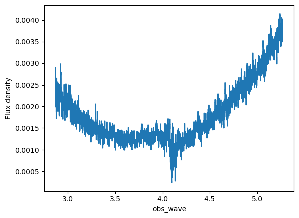
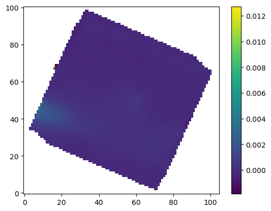
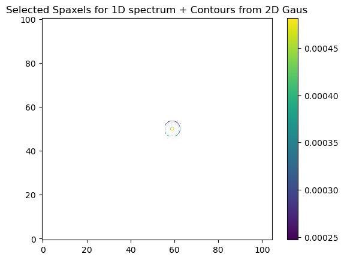
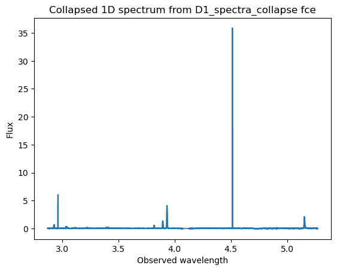
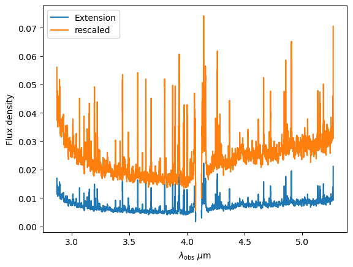
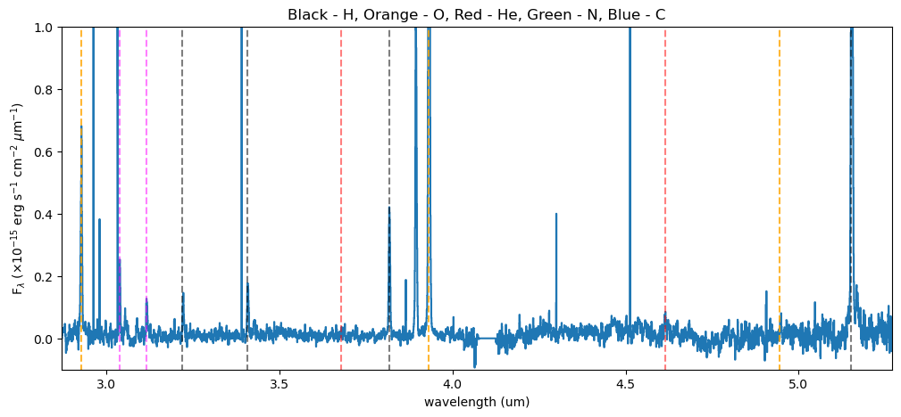

.. _Starting-with-QubeSpec:

.. code:: ipython3

    #importing modules
    import numpy as np
    import matplotlib.pyplot as plt; plt.ioff()
    
    nan= float('nan')
    pi= np.pi
    e= np.e
    
    c= 3e8
    h= 6.62*10**-34
    k= 1.38*10**-23
    
    %load_ext autoreload
    %autoreload 2
    
    import QubeSpec as IFU
    import QubeSpec.Plotting as emplot
    import QubeSpec.Fitting as emfit
    import yaml
    

Initializing the QubeSpec and preparing the data for fitting
============================================================

In order to make things easier for the user, I writen a simple
dictionary called QubeSpec_setup. You can define all the necessary
variables in this dictionary and then just run all the cells. Although
there is a short description next to it, there will be full explanation
of each variable accompanying the each function.

.. code:: ipython3

    # Lets define additional info
    PATH='/Users/jansen/My Drive/Astro/'
    
    QubeSpec_setup = {}
    ######################
    # Basic Properties
    QubeSpec_setup['z'] = 6.851 # Redshift of the object 
    QubeSpec_setup['ID'] = 'COS30_R2700' # Name of the object
    QubeSpec_setup['instrument'] = 'NIRSPEC_IFU_fl' # Name of the instrument - KMOS, SINFONI, NIRSPEC_IFU (when original units Fnu from pipeline), NIRSPEC_IFU_fl (for GTO pipeline Flambda)
    QubeSpec_setup['band'] = 'R2700' # Or PRISM, doesnt matter for JWST - For KMOS and SINFONI it should H or K or HK or YJ or Hsin, Ksin for SINFONI
    QubeSpec_setup['save_path'] = PATH+'COS30_IFS/Saves/' # Where to save all the info. 
    QubeSpec_setup['file'] = PATH+'COS30_IFS/Data/COS30-COS-6.80-S_jw1217_o007_ff_px0.05_drizzle_ODfde95.0_VSC_MRC_MSA_EMSA_m2ff_xyspikes96_CTX1068.pmap_v1.8.2_g395h-f290lp_cgs_s3d.fits'# Path to the Data Cube
    QubeSpec_setup['norm'] = 1e-15 # Normalization to make the integrated spectrum around 0.5-8
    
    #####################
    # PSF Matching info
    QubeSpec_setup['PSF_match'] = True
    QubeSpec_setup['PSF_match_wv'] = 5.2
    
    #####################
    # Masking Channels
    QubeSpec_setup['mask_threshold'] = 6 # multiple of the median error to mask
    QubeSpec_setup['mask_channels'] = []  # any particular channels to mask - with JWST not necessarily 
    
    #####################
    # Background Subtraction
    QubeSpec_setup['Source_mask'] = PATH+'COS30_IFS/Data/R2700_source.fits' # path to find the source mask to mask the source during background subtraction - Can be None but then you have to supply wavelength range around some emission line to construct a line map and let sextractor create the mask
    QubeSpec_setup['line_map_wavelength'] = [3.92,3.94] # Wavelength range used to create a line map for source detection - only used if 'Source_mask' is None
    
    #####################
    # Extracting spectrum 
    QubeSpec_setup['Object_center'] = [59,50] # X,Y - center of the object 
    QubeSpec_setup['Aperture_extraction'] = 0.2 # radius of the aperture to extract the the 1D spectrum
    # Error stuff - explained below
    QubeSpec_setup['err_range']=[3.95,4.05, 5,5.1] # err ranges for renormalising the error extension
    QubeSpec_setup['err_boundary'] = 4.1 # where to switch - location of the detector gap
    
    #####################
    # Fitting Spaxel by Spaxel
    QubeSpec_setup['Spaxel_mask'] = PATH+'COS30_IFS/Data/R2700_source_mask.fits' # which spaxel to fit in spaxel-by-spaxel fitting - source mask and Spaxel mask can be the same
    QubeSpec_setup['ncpu'] = 8 # number of cores to use for 
    QubeSpec_setup['Spaxel_Binning'] = 'Nearest' # What binning option to use  - 'Nearest', 'Single'
    
    
    with open(QubeSpec_setup['save_path']+'QubeSpec_setup.yml', 'w') as outfile:
        yaml.dump(QubeSpec_setup, outfile, default_flow_style=False, allow_unicode=True)

Initalize the cube
------------------

Here we initialize the Cube class and load the cube. We also perform few
minor preps. You will need:

1) Full_path = path to the fits cube
2) z - redshift of the source
3) ID - name of the source. For example: COS-3018_R2700
4) flag - Instrument glag - Options: ‘KMOS’, ‘SINFONI’, ‘NIRSPEC’,
   ‘NIRSPEC_fl’ and ‘MIRI’
5) savepath - When do you save all of the products.
6) Band - For flag - ‘NIRSPEC’ or ‘NIRSPEC_fl’ just go ‘NIRSPEC’ ,
   ‘KMOS’: ‘YJ’, ‘H’, ‘K’; ‘SINFONI’: ‘Ysin’, ‘Hsin’, ‘Ksin’
7) norm - normalization of the cube to make the integrated spectrum
   ~0.5-5 ish. The code just handles things better when the spectra are
   around 1.

.. code:: ipython3

    Cube = IFU.Cube( Full_path = QubeSpec_setup['file'],\
                    z =  QubeSpec_setup['z'], \
                    ID =  QubeSpec_setup['ID'] ,\
                    flag =  QubeSpec_setup['instrument'] ,\
                    savepath = QubeSpec_setup['save_path'] ,\
                    Band = 'NIRSPEC',\
                    norm = QubeSpec_setup['norm'])

Masking
-------

Here we are going to make some some obvious outliers. In JWST data, they
have often obvious spikes in the error extension. By defining typical
value of the error extension and some scale threshold (10 000) seems
good we can caluclate a value above which the code will flag any
outliers. We can also give a list of indices representing channels that
need some manual masking.

.. code:: ipython3

    Cube.mask_JWST(0, threshold= QubeSpec_setup['mask_threshold'], spe_ma=QubeSpec_setup['mask_channels'])

Background Subtraction
----------------------

When dealing with JWST data, it is important to perform the background
subtraction. This algorithm is courtesy of Francesco D’Eugenio. The code
estimates the median background in each channel, masking out any pixels
that are not covered by the cube (the edges) and the source - see later.
The Median background is estimate across filter_size (default 5,5, but
can be changed). Once the background cube is estimated, it is smoothened
by a median filter (with wave_smooth =25 channels, another free
parameter).

There are currently two ways of dealing with the source mask:

1) You supply the actual source mask from QFits view.

2) You let the code find the object using the source etxractor. At that
   point, please supply the wave_range =[X,Y], which will be used to
   collapse the cube to create a line map. Furthermore, you can change
   the detection_threshold=3 for the sextractor.

Eitherway, at the end you will get a background (Cube.background) and a
subtracted flux cube (Cube.flux)

.. code:: ipython3

    if any(QubeSpec_setup['Source_mask']) !=None:
        print('Loading source mask from file')
        source_bkg = IFU.sp.QFitsview_mask(QubeSpec_setup['Source_mask']) # Loading background mask
    Cube.background_subtraction( source_mask=source_bkg, wave_range=QubeSpec_setup['line_map_wavelength'], plot=1) # Doing background subtraction
    
    plt.show()

.. code:: ipython3

    Cube.PSF_matching(PSF_match = QubeSpec_setup['PSF_match'],\
                        wv_ref= QubeSpec_setup['PSF_match_wv'])

Extracting your first spectrum
----------------------

In order to extract a specturm we first collpase the cube into a white
light image using collpase_white function. Then we find the center of
the galaxy from the continuum. With KMOS or seeing limited SINFONI
observations, we could use 2D Gaussian in order to find the center of an
object. With NIRSpec and SINFONI AO, galaxies can be quite clumy and
hence it often fails. Therefore I would suggest using the manual= [x,y]
keyword in order to define it yourself.

Next we select and collapse the aperture using the D1_spectra_collapse
with he following keywords: 1) radius of the extraction circle (units of
arcseconds) 2) add_save = string - name appended to the basic file name
when saving the spectrum 3) err_range - list of 2 or 4 numbers. This are
wavelength boundries used (read full explanation below) 4) boundary - if
you use 4 numbers in err_range, boundary will be where the error calc
will be split. 5) plot_err = 1/0 - do you want to plot the comparison of
the errors estimated in this code and the ones from the NIRSpec
extension

For NIRSpec spectra: Unfortunately, we cannot use the error extension
from the pipeline as there is scaling issue at hand. However, the error
extension maintains all of the correlation between channels. Because of
that, we estimate the error from the error extension and then compared
to the median value of this error array to the standard deviation of the
continuum. The err_range values are defining the wavelength region that
is used to estimate the standard deviation of the spectrum. There are
two options of supplying the right info:

a) err_range = [lower, upper] - in this case yo the upper and lower
   wavelength range of emission line free part of the spectrum. The code
   will estimate the standard deviation of that part to the error
   extension and scale it.

b) err_range = [lower_a, upper_a, lower_b, upper_b] and boundary=4.1 -
   in this case yo the upper and lower wavelength range of TWO seperate
   emission line free sections of the spectrum. The code will estimate
   the standard deviation of that part to the error extension and scale
   it for each section. The boundary value is the wavelength value where
   you apply the the lower or upper scaling factor. Example below:

err_range=[3.95,4.05, 5,5.1] and boundary=4.1

The code will estimate the standard deviation from the spectrum and
hence the scaling factor for two section: 3.95-4.05 and 5.-5.1. It will
then applying the two scaling factor to error extension with lambda<4.1
and lambda>4.1.

So the err_range should be section of spectra without any emission
lines. The boundary should be somewhere between emission lines of
interest of in case of R2700 - the detector gap

.. code:: ipython3

    Cube.collapse_white(1)
    
    Cube.find_center(1, manual=QubeSpec_setup['Object_center'])
    Cube.D1_spectra_collapse(1, addsave='',rad=QubeSpec_setup['Aperture_extraction'], err_range=QubeSpec_setup['err_range'], boundary=QubeSpec_setup['err_boundary'], plot_err=1)
    plt.show()

Saving the class and resume
---------------------------

At any point you can save the Cube class with save(file_path) function.
Later on you can Initialize the empty class again and then load it with
load(file_path)

.. code:: ipython3

    Cube.save('/Users/jansen/Test.txt') # 
    
    Cube2 = IFU.Cube()
    Cube2.load('/Users/jansen/Test.txt')

Plotting spectrum
-----------------

Lets just have a look at all the emission lines in the spectrum.

.. code:: ipython3

    f, ax = plt.subplots(1, figsize=(12,5))
    
    ax.plot(Cube.obs_wave, Cube.D1_spectrum, drawstyle='steps-mid')
    
    ylow = -0.2
    yhig = 10
    
    ax.vlines(0.5008*(1+Cube.z),ylow,yhig, linestyle='dashed',color='orange', alpha=0.8)
    ax.vlines(0.3727*(1+Cube.z),ylow,yhig, linestyle='dashed',color='orange', alpha=0.8)
    ax.vlines(0.6300*(1+Cube.z),ylow,yhig, linestyle='dashed',color='orange', alpha=0.8)
    
    
    ax.vlines(0.6563*(1+Cube.z),ylow,yhig, linestyle='dashed',color='k', alpha=0.5)
    ax.vlines(0.4861*(1+Cube.z),ylow,yhig, linestyle='dashed',color='k', alpha=0.5)
    ax.vlines(0.4340*(1+Cube.z),ylow,yhig, linestyle='dashed',color='k', alpha=0.5)
    ax.vlines(0.4100*(1+Cube.z),ylow,yhig, linestyle='dashed',color='k', alpha=0.5)
    ax.vlines(0.1215*(1+Cube.z),ylow,yhig, linestyle='dashed',color='k', alpha=0.5)
    ax.vlines(0.6731*(1+Cube.z),ylow,yhig, linestyle='dashed',color='k', alpha=0.5)
    
    ax.vlines(0.3869*(1+Cube.z),ylow,yhig, linestyle='dashed',color='magenta', alpha=0.5)
    ax.vlines(0.3968*(1+Cube.z),ylow,yhig, linestyle='dashed',color='magenta', alpha=0.5)
    ax.vlines(0.2424*(1+Cube.z),ylow,yhig, linestyle='dashed',color='magenta', alpha=0.5)
    
    
    ax.vlines(0.4686*(1+Cube.z),ylow,yhig, linestyle='dashed',color='red', alpha=0.5)
    ax.vlines(0.5877*(1+Cube.z),ylow,yhig, linestyle='dashed',color='red', alpha=0.5)
    
    ax.set_title('Black - H, Orange - O, Red - He, Green - N, Blue - C')
    
    ax.set_xlabel('wavelength (um)')
    ax.set_ylabel(r'F$_\lambda$ ($\times 10^{-15}$ erg s$^{-1}$ cm$^{-2}$ $\mu$m$^{-1}$)')
    
    ax.set_xlim(min(Cube.obs_wave), max(Cube.obs_wave))
    ax.set_ylim(-0.1, 1)
    plt.show()

